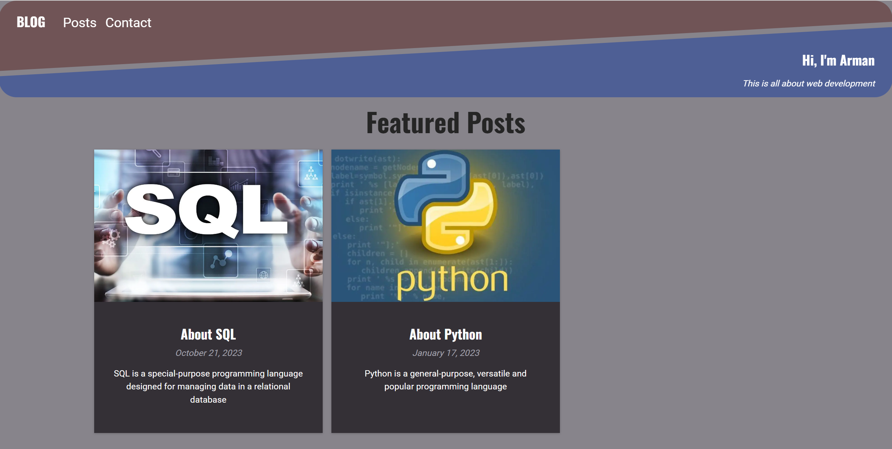
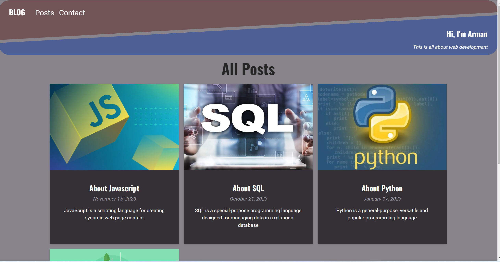
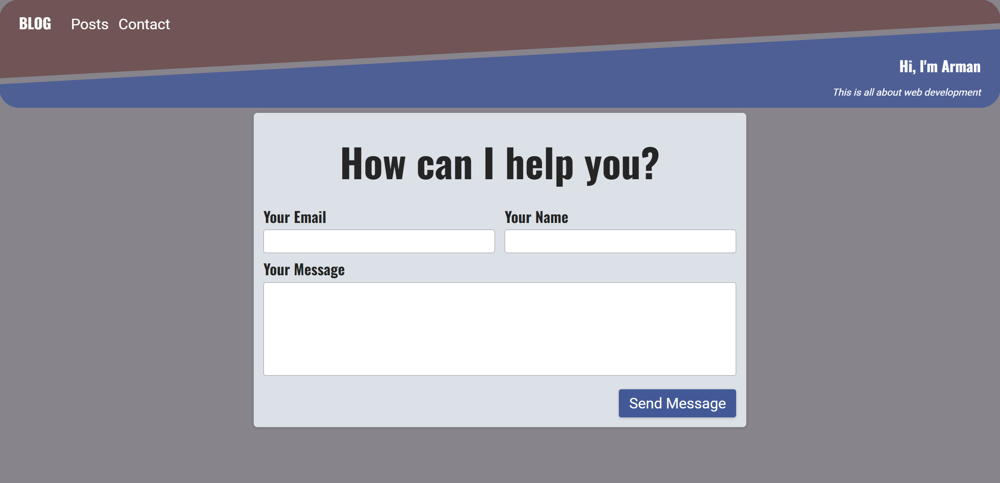

# Blog

## Description
This is a blog website, where the user can read blogs and send a message to the owner. Blogs are saved in the markdown files. The messages sent to the owner are saved in the mongodb database.

## Technologies Used
- HTML
- CSS
- JavaScript (ES6)
- Next.js
- Markdown
- Mongodb

## Usage
Use the navbar buttons to navigate between the pages. Click to the blog to read its content. Use the contact page to send a message.

### Go to [Blog](https://blog-beta-eosin.vercel.app/)

Featured Posts

All Posts

Contact Me

## Questions
### Use the links below if you have any questions.
- Email Address - [armanbarseghyan83@gmail.com](mailto:armanbarseghyan83@gmail.com)
- Linkedin - [https://www.linkedin.com/in/arman-barseghyan](https://www.linkedin.com/in/arman-barseghyan)
- GitHub Profile - [https://github.com/ArmanBarseghyan83](https://github.com/ArmanBarseghyan83)
